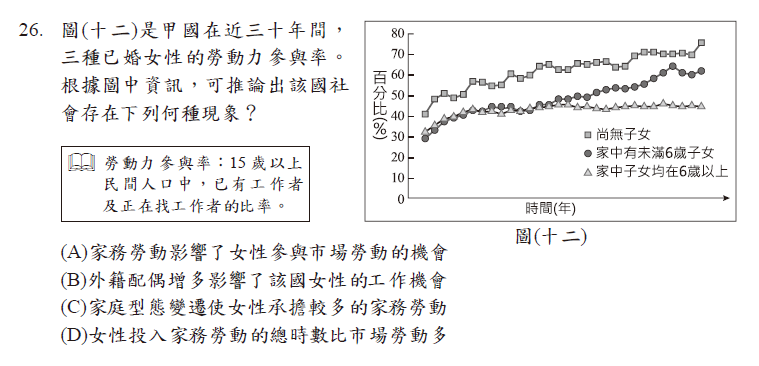
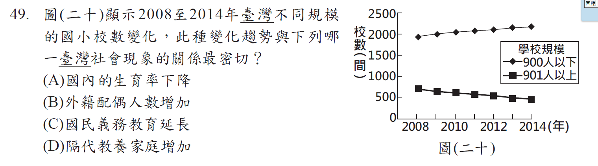

Source filename: `ICCS_Cognitive_Domains_0821.docx`  
Source commit: `2795d7c`  
Issue: [#466](https://github.com/paulpengtw/exam-generation/issues/466)

# ICCS Cognitive Domains 

Each of the four content domains encompasses different types of knowledge concerned with civic and citizenship issues (factual, procedural, conceptual, and meta-cognitive). The civic knowledge framework considers the extent to which students develop the capacity to process the content of the four domains and reach conclusions that are broader than any single piece of knowledge. This includes the processes involved in understanding complex sets of factors influencing civic actions and planning for and evaluating strategic solutions and outcomes. The scope of civic knowledge as conceptualized for ICCS is not limited to direct applications of knowl-edge that reach conclusions about concrete situations. It also includes the selection and assimilation of knowledge, as well as the understanding of multiple concepts, so that conclusions about complex, multifaceted, unfamiliar, and abstract situations can be reached. To capture these distinct features of cognitive knowledge, ICCS 2022 distinguishes remembering or recalling information or processing content in terms of understanding from applying an understanding to new situations . 

When responding to the ICCS 2022 civic knowledge test, students need to know the civic and citizenship content that is assessed. They also need to be able to apply more complex cognitive processing to their civic and citizenship knowledge and to relate their knowledge and understandings to real-world civic action. Consequently, two cognitive domains are observable, the first, knowing, outlines the types of civic and citizenship information that students are required to demonstrate knowledge of. The second domain, reasoning and applying, details the cognitive processes that students require to reach conclusions and to translate their knowledge into civic actions. Similar definitions of cognitive domains can be found in the mathematics and science frameworks for TIMSS (see Mullis and Martin, 2013, 2017).

## Knowing

The cognitive domain, *knowing*, refers to the learned civic and citizenship information that students use when engaging in the more complex cognitive tasks that help them make sense of their civic worlds. Students are expected to remember, recall or recognize definitions, descriptions, and the key properties of civic and citizenship concepts and content, and to illustrate these with examples. Due to the nature of ICCS as an international study, the concrete and abstract concepts students are expected to know in the core cognitive assessment are those that can be generalized across societies. 

The cognitive domain, *knowing*, relates to the following cognitive processes: 

*Defining*: Respondents are able to identify statements that directly define civic and citizenship concepts and content. 

*Describing*: Respondents are able to identify statements that directly describe the key characteristics of civic and citizenship concepts and content. 

*Illustrating with examples*: Respondents are able to identify examples that directly support or clarify statements about civic and citizenship concepts and content. 

## Reasoning and Applying 

The cognitive domain, *reasoning and applying*, refers to the ways in which students use civic and citizenship information to reach conclusions that are broader than the contents of any single concept and to make use of these in real-world contexts. *Reasoning and applying* includes, for example: the use of knowledge to reach conclu-sions about familiar concrete situations; the selection and assimilation of knowledge and understanding of multiple concepts; the evaluation of proposed and enacted courses of action; providing recommendations for solutions or courses of action. 

The cognitive domain, *reasoning and applying*, relates to the following cognitive processes: 

*Interpreting information*: Respondents are able to identify statements about information presented in textual, graphical, and/or tabular form that make sense of the information in the light of a civic and citizenship concept. 

*Relating*: Respondents are able to use the key defining aspects of a civic and citizenship concept to explain or recognize how an example illustrates a concept. 第二個意思是，學生能從幾個事件中，抽取相同之處找出彼此的關聯(像是因果關係、相互影響…)

*Justifying*: Respondents are able to use evidence and civic and citizenship concepts to construct or recognize a reasoned argument to support a point of view.

*Integrating*: Respondents are able to identify connections between different concepts across themes and across civic and citizenship content domains. 第二個意思是，學生要用跨科、跨冊別、跨單元、跨領域的學科概念來解決問題。

*Generalizing*: Respondents are able to identify civic and citizenship conceptual principles manifested as specific examples and explain how these may apply in other civic and citizenship contexts. 

*Evaluating*: Respondents are able to identify judgments about the advantages and disadvantages of alternative points of view or approaches to civic and citizenship concepts and actions. 

*Suggesting solutions*: Respondents are able to identify courses of action or thought that can be used to alleviate civic and citizenship problems expressed as conflict, tension, and/or unresolved or contested ideas. 

*Predicting*: Respondents are able to identify likely outcomes of given civic and citizenship policies strategies and/or actions. 

## 試題舉例

### Knowing- Defining and Describing

#### 1-1題目1

下面是小美在某一份專題報告中舉了3個例子:

(1)流感、SARS等疾病，透過便捷的交通運輸網在世界各地蔓延。 

(2)部分國家發展工業時大量使用化石燃料，加速地球暖化。 

(3)國際金融風暴與國際油價攀升，對各國經濟發展造成影響。

根據其內容判斷，下列何者最可能是小美報告的主題？ 

(A) 科技倫理 
(B) 全球關連 
(C) 區域統合 
(D) 國際貿易

#### 1-2題目1說明

題幹是提供全球化現象(也就是提供生活經驗或社會現象)，評量學生是否具有全球關聯的知識概念，所以符合Knowing- Defining and Describing。

選項是國中公民課本教過的概念，這樣國中生才可以回答。

這種題目是幫助學生建構基本知識概念，在一個題組中最多只會有1題。

#### 2-1題目2

下列是三位行政首長的發言內容： 

甲縣縣長：「感謝縣議會的支持，本縣領先全國引進熱氣球活動，創造商機。」

乙市市長：「因應颱風來襲，為維護市民財產安全，本市今晚開放市區紅線停車。」

丙縣縣長：「未來是否在本縣設置觀光賭場，我們將交由縣民以公投方式決定。」

上述三位首長的發言內容，最能直接展現哪一種政治制度的特色? 

(A) 中央集權 
(B) 責任政治 
(C) 三權分立 
(D) 地方自治

#### 2-2題目2說明

不同縣市推動的事情不同，顯示因地制宜，因地制宜為地方自治的特徵。

題目提供三個縣市不同的建設現象(也就是提供生活經驗或社會現象)，這些反映地方自治的因地制宜現象，不同的縣市會因應縣市內居民的需求，推動不同的建設。評量學生是否具有地方自治的知識概念，所以符合Knowing- Defining and Describing。

題幹的生活經驗或社會現象，反映地方自治的因地制宜現象，選項必須是國中公民課本教過的概念。

#### 3-1題目3

表（一）是小津整理的交易媒介比較表，表中甲、乙最可能為下列哪一組合？ 

**表（一）**

| 交易媒介 | 甲 | 乙 |
| --- | --- | --- |
| 特色一 | 可直接支付各項消費 | 須事先存入足夠金額，並搭配特定設備才能使用 |
| 特色二 | 由國家發行並賦予價值 | 多由民間企業發行 |
| 特色三 | 可能會面臨兌換零錢的困擾 | 免去購物找零錢的困擾 |

(A) 商品貨幣與儲值卡 
(B) 商品貨幣與信用卡 
(C) 法定貨幣與儲值卡 
(D) 法定貨幣與信用卡

#### 3-2題目3說明

題目呈現法定貨幣和儲值卡兩個概念的特徵描述比較表，表中有三項特徵的比較，看學生能不能經由表中的特色，選出答案是法定貨幣、儲值卡。

這一題是呈現法定貨幣和儲值卡兩個概念的特徵描述，讓學生判斷出就是在講法定貨幣和儲值卡，所以符合Knowing- Defining and Describing。

#### 4-1 題目4

小蔓一歲時親生父母離婚，之後與母親同住。四歲時，母親與阿德再婚，小蔓和他們兩人一起組成現在的家庭。若阿德婚後未曾進行任何法律程序改變家中成員關係，僅根據上述內容判斷，小蔓與阿德具有什麼親屬關係?

(A) 姻親 
(B) 配偶 
(C) 旁系血親 
(D) 直系血親

#### 4-2題目4說明

這一題是給生活中的實例，讓學生去判斷符合學過的哪一個概念或名詞，因此符合Knowing- Defining and Describing。

題目是給家庭裡的關係，去判斷兩人親屬關係是姻親，為了要讓學生可以判斷出是姻親，本題的題幹要有姻親的特徵在裡頭，在這邊，是因為小曼的母親和阿德結婚，所以小蔓和阿德兩個沒有血緣關係的人成為姻親。

選項要是親屬關係，且要是課本教過的。

### Knowing- Illustrating with examples

#### 1-1題目1

為維護消費者權益，政府制定法律對市場上供應不實有機農產品的業者處以罰鍰，同時也能保障生產真正有機農產品農民的權益。上述主管機關對不實業者的處罰，與下列何者受到的處罰類型相同？ 

(A) 小華拒絕歸還向同事借的相機 
(B) 大明竊取隔壁鄰居家中的財物 
(C) 官員制定政策引發許多民眾不滿 
(D) 父母縱容少年抽菸而遭行政處分

#### 1-2題目1說明

在前面Knowing- Defining and Describing那邊的題目，常常是是給一個情境，讓你選出對應的概念。現在這邊是，想評量學生了解定義和特徵後，是不是能舉一個例子。

這個題目是給一個罰鍰的例子，這個例子是說業者違反行政法規，主管機關對其進行的處罰，學生要判斷出罰鍰屬於行政罰，是行政責任，請學生從選項中，選出也是行政責任的例子，所以是對應Knowing- Illustrating with examples。

這題四個選項對應不同的法律責任或政治責任，都是課本教過的，A是民事責任、B是刑事責任、C是政治責任、D是行政責任，這題其實是在考行政責任，所以看選項中誰是行政責任的承擔就是答案。

#### 2-1題目2

某大學於學期末時，在校內美食街設立意見回饋箱，消費者有任何建議都可以寫在意見單上投入回饋箱中，學校會參考這些回饋的意見，藉以改善未來美食街的營運方式。根據上述內容判斷，哪一項回饋意見，是希望透過增加市場競爭來改善美食街的營運？

(A) 廠商應提供校內師生購買餐點九折優惠 
(B) 應要求廠商提供餐點食材的生產履歷證明 
(C) 希望廠商販售份量較少且價格較便宜的餐點 
(D) 學校應招募更多廠商進駐美食街提供多元餐點

#### 2-2題目2說明

主要是要考什麼是市場競爭程度、市場競爭程度怎麼區別、考影響市場競爭的要素是什麼。

這題實際上就是要學生選出一個提升市場競爭程度的例子，所以是對應Knowing- Illustrating with examples。

有很多學生會選A，但這是提升廠商的競爭力，不是提升市場競爭，這裡是要提升市場的競爭程度，站在消費者(也就是站在學校的立場)，會希望廠商多一點。

#### 3-1 題目3

老師在課堂上講解權力分立的概念，說明如何透過分權制衡的機制，以避免政府濫權或侵害人民的權利，這種政府體制運作的原則，廣為多數民主國家所採用。下列何者的互動關係符合上述概念？ 

(A) 總統任命執政黨的黨員擔任行政院院長 
(B) 縣長推動觀光活動以籌措地方政府財源 
(C) 行政院對於窒礙難行的法案提出覆議 
(D) 民眾為表達對政策不滿上街遊行抗議

#### 3-2題目3說明

題幹給你權力分立的概念，然後請學生選出一個符合權力分立的例子，所以是對應Knowing- Illustrating with examples。

要注意的是，Knowing- Illustrating with examples的真正精神是讓學生自己舉例、自己寫出例子，但如果要出成選擇題，便無法真的讓學生舉例，而是給他四個例子，讓他選出正確的例子。

### Reasoning and Applying- Interpret information

#### 1-1題目1

甲國女性的就業率，長期以來皆大幅低於全國平均值，因此該國政府調查女性勞動人口中未就業者的原因，表（八）是調查結果中的部分統計資料。關於此資料的解讀，下列何者最適當？

表（八）　單位：%

| 年齡（歲） | 需照顧未滿12歲子女 | 需照顧65歲以上家屬 | 負責打理家務 | 健康狀況不佳 | 其他 |
| --- | --- | --- | --- | --- | --- |
| 30-34 | 65.37 | 0.89 | 11.43 | 2.98 | 19.33 |
| 35-39 | 55.35 | 2.6 | 21.39 | 4.26 | 16.4 |
| 40-44 | 35.36 | 5.16 | 39.7 | 7.15 | 12.63 |
| 45-49 | 7.05 | 8.1 | 58.04 | 5.5 | 21.31 |
| 50-54 | 0.53 | 7.58 | 56.69 | 4.69 | 30.51 |

(A) 老年人口比例呈現上升趨勢 
(B) 家庭職能因社會變遷而弱化 
(C) 家庭平權的觀念仍有待加強 
(D) 勞雇間的權力與資源不對等

#### 1-2題目1說明

題幹給一個表格，呈現女性未能就業的原因和比例，讓學生可以從資料發現，女性未就業主要是負擔家務勞動，這凸顯了現在的家務勞動還是以女性為主，所以對資料的解讀是不符合性別平權的概念。

這題是學生要利用他學過的社會領域概念去解讀資料，因此符合Reasoning and Applying- Interpret information。

這題在設計時，將各年齡層女性未就業的原因設計成一個表格，表格中呈現女性未能就業的4個原因，其中3個是女性承擔了哪些家務勞動，第4個是跟家務勞動無關的因素，評量學生是否在閱讀表格資料後，能發現家庭平權有待改善。

#### 2-1題目2

表（二）是恬恬為了製作課堂報告所蒐集的資料，統計針對某候選人的新聞在各電視臺報導時間中所占比例。根據表中資料判斷，下列何者最可能是恬恬探究這份資料後，建議閱聽人應注意的事項？

表（二）

| 電視臺 | 占播報時間比例（%）總比例 | 正面報導 | 負面報導 |
| --- | --- | --- | --- |
| 水果臺 | 36 | 28 | 4 |
| F News | 12 | 4 | 6 |
| 西水新聞 | 7 | 3 | 2 |
| W 電視 | 28 | 4 | 21 |

註: 統計時間：5/1-5/7每日19:00～20:00的新聞

(A) 覺察媒體的報導內容與事實不符 
(B) 解讀媒體報導中的性別刻板印象 
(C) 留意媒體業者是否持有特定的立場 
(D) 關注媒體是否善盡監督政府的責任

#### 2-2題目2說明

這題是請學生解讀資料，評量學生是否有媒體識讀的能力。

題目是給一個表格，呈現四個電視台的正面報導、負面報導的播報時間佔比不同，評量學生是否能在解讀資料後，發現媒體存在特定的立場，因此這題是對應Reasoning and Applying- Interpret information。

在教學時，教師會提到媒體識讀的概念之一是，媒體會選擇他喜歡的資料，屏蔽不喜歡的資料(媒體有遮罩的效果)，而在現今的演算法的時代，會把閱讀者喜歡的資料餵給閱讀者。

#### 3-1題目3

表（一）為二位我國某縣縣民的部分資料，根據我國法律規定判斷，關於此二位縣民的敘述，下列何者正確？

表（一）

| 姓名 | 陳小花 | 吳阿杰 |
| --- | --- | --- |
| 年齡 | 25歲 | 28歲 |
| 設籍時間 | 7個月 | 5個月 |
| 現況 | 受監護宣告 | 被宣告褫奪公權 |

(A) 皆具備完全行為能力 
(B) 皆曾受到刑事處罰判決 
(C) 皆無法參選該縣公職人員 
(D) 皆不具備該縣縣長投票資格

#### 3-2題目3說明

題幹是用表格分項目來呈現兩個人在參選與投票資格上的不同。

題幹提供了兩個人的年齡、設籍、及其他選舉資格條件(例如行為能力、褫奪公權)，評量學生能否用選舉投票的制度(參選資格)的概念，去解讀這份資料，判斷出這兩個人在參選與投票資格上是不同的，所以這一題符合Reasoning and Applying- Interpret information。

選項A是在課本中講民法時提到、選項B是課本講民法(受監護宣告)、刑罰那邊提到。

#### 4-1題目4

我國在2007年修正了《民法》中關於子女姓氏的規定，將原本子女從父姓的原則，修改為父母應以書面方式，約定子女從父姓或從母姓。表（七）是2012至2018年關於新生兒約定從母姓的統計數據。根據表中資料判斷，對於修法後新生兒姓氏的變化，下列何種說法最合理？ 

表（七）

| 年分 | 出生登記總人數（人） | 約定從母姓比例（%） |
| --- | --- | --- |
| 2012 | 229,760 | 1.5 |
| 2013 | 199,113 | 1.6 |
| 2014 | 210,383 | 1.8 |
| 2015 | 213,598 | 1.9 |
| 2016 | 208,440 | 2.1 |
| 2017 | 193,844 | 2.1 |
| 2018 | 181,601 | 2.3 |

(A) 新生兒約定從母姓的比例顯示性別歧視日趨嚴重 
(B) 選擇新生兒姓氏時仍會受到其他社會規範的影響 
(C) 法律變遷促使多數人改變新生兒姓氏的選擇結果 
(D) 基於傳宗接代需求約定從母姓的新生兒多為男嬰

#### 4-2題目4說明

學生要用社會科的學科概念，並根據表格的資料，來判斷哪個解讀是合理的，所以對應Reasoning and Applying- Interpret information。

學生要想到自己學過在我們的風俗習慣(傳統文化)中，小孩是從父姓，並從表格數據發現，就算法律規範變成子女也可以從母姓，但小孩還是從父姓居多，因此可以推測出風俗習慣(傳統文化)沒有變。

風俗習慣是在社會規範內，故答案是B。

#### 5-1題目5

「我國原本由宏都拉斯進口大量白蝦，但2023年與該國斷交後，我國恢復對該國產品課徵關稅，部分進口業者的營運遭受衝擊，進口量大幅下滑。我國官員受訪時提及，2025年將開放貝里斯的白蝦零關稅進口至我國，以增加商品供應來源。」僅根據上述內容判斷，關於此二項進口政策變化產生的各別影響，下列何項推論最合理？ 

(A) 受到對貝里斯政策的影響，我國市場上白蝦的售價下降 
(B) 受到對貝里斯政策的影響，貝里斯的貿易出超金額下降 
(C) 受到對宏都拉斯政策的影響，宏都拉斯的貿易出超金額上升 
(D) 受到對宏都拉斯政策的影響，我國白蝦市場的競爭程度上升

#### 5-2題目5說明

題幹提供我國和宏都拉斯的白蝦貿易情形，請學生解讀資訊。

題幹提供了我國和宏都拉斯的白蝦貿易情形，在2023年，我國對宏都拉斯課關稅，所以白夏進口量下跌、市場供給減少，到了2025年開放白蝦進口時不用課關稅、希望2025年進口量變大。學生要閱讀題幹的資訊，再加上他在國中社會課堂學到的概念，推論出答案，所以這題是符合Reasoning and Applying- Interpret information。

選項B，以目前的資訊是無法判斷。

#### 6-1題目6

圖（十二）是甲國在近三十年間，三種已婚女性的勞動力參與率。根據圖中資訊，可推論出該國社會存在下列何種現象？ 

註: 勞動力參與率是指15歲以上民間人口中，已有工作者及正在找工作者的比率。

(A) 家務勞動影響了女性參與市場勞動的機會 
(B) 外籍配偶增多影響了該國女性的工作機會 
(C) 家庭型態變遷使女性承擔較多的家務勞動 
(D) 女性投入家務勞動的總時數比市場勞動多

#### 6-2題目6說明

給一個圖表，顯示三種已婚女性的勞動力參與率，學生要去解讀這份資料的意義，所以符合Reasoning and Applying- Interpret information。

學生要從資料中，發現沒小孩的女性勞動參與較高，有小孩的女性勞動參與力較低，所以推論出有小孩的女性承擔較多的家務勞動。

題目旨在引導學生推論「家庭型態變遷使女性承擔較多的家務勞動」，因此，題幹所選用的數據資料應能呈現不同家庭型態的女性在家務勞動投入程度上的差異，使學生能根據資料進行比較與推論。

#### 7-1題目7

圖（二十）顯示2008至2014年臺灣不同規模的國小校數變化，此種變化趨勢與下列哪一臺灣社會現象的關係最密切？ 

(A) 國內的生育率下降 
(B) 外籍配偶人數增加 
(C) 國民義務教育延長 
(D) 隔代教養家庭增加

#### 7-2題目7說明

題幹是給一個圖表，評量學生根據數據，發現小校越來越多、大校越來越少，推論出學校中的人數逐漸減少，顯示生育率下降。所以這題符合Reasoning and Applying- Interpret information。

### Reasoning and Applying- Relate or Integrate

#### 1-1題目1

臭蟲又稱床蝨，因常躲在床墊中而得名，人類被叮咬後皮膚會紅腫且奇癢無比。臭蟲會隨人群移動而擴散，例如：2023年法國爆發臭蟲危機，因觀光客、商務旅客及國際移工的遷移，使得臭蟲經由藏在行李中，蔓延至許多國家。上述內容最主要在探討下列何項議題？ 

(A) 國際移工引入帶來的文化衝突 
(B) 區域糾紛擴大引發的民生困境 
(C) 高度工業化與氣候變遷的關係 
(D) 經濟全球化對人類生活的影響

#### 1-2題目1說明

臺灣的國中會考社會題目，喜歡用A學科素材考B學科的概念，這題的題幹，是給一個歷史上曾經發生的事件，請學生判斷事件最可能在探討公民科中的哪個重要概念

學生要從題幹中，判斷出這個事件和哪個公民概念有關聯，所以是符合Reasoning and Applying- Relate or Integrate。

這題的題幹，是給一個歷史上曾經發生的事件，請學生判斷事件最可能在探討公民科中的哪個重要概念。

這題的答案是「經濟全球化對人類生活的影響」，在設計題目時，題幹便呈現經濟全球化後對人類生活影響的例子：因為觀光客、商務旅客、國際移工的遷移，導致本來發生在法國的事情影響到全球。有這樣的例子說明，學生才能判斷出答案。

將本題(法國臭蟲)和小美這題做比較：

下面是小美在某一份專題報告中舉了3個例子:

(1)流感、SARS等疾病，透過便捷的交通運輸網在世界各地蔓延。 

(2)部分國家發展工業時大量使用化石燃料，加速地球暖化。 

(3)國際金融風暴與國際油價攀升，對各國經濟發展造成影響。

根據其內容判斷，下列何者最可能是小美報告的主題？ 

(A) 科技倫理 
(B) 全球關連 
(C) 區域統合 
(D) 國際貿易

「小美」這一題的題幹直接提供全球化的相關現象，也就是以生活經驗或社會現象作為情境，主要評量學生是否具備「全球關聯」的知識概念，並能辨識題幹所呈現的現象。因此，此題較符合 Knowing－Defining and Describing 的認知層次，整體難度也相對較低。相較之下，本題（法國臭蟲）除了要求學生先辨識題幹所描述的現象與「全球關聯」有關之外，還必須進一步判斷其所涉及的是哪一類全球化議題。例如，學生需要從觀光客、商務旅客及國際移工的跨國移動等線索，判斷此現象屬於經濟全球化對人類生活所帶來的影響，並能與其他類型的全球化影響（如政治全球化）加以區辨。因此，相較於「小美」一題，本題需要進行較多一層的判斷與辨別，認知要求也較高，不僅僅只有Knowing的層次，已經到了Reasoning and Applying。

#### 2-1題目2

小皇為了繳交某一主題的課堂報告，蒐集了下列三則新聞報導： 

(1)報導一:根據調查顯示，過半數國中、小學生課後會上安親班或補習班。親子共處時間從事的活動，多數回答看電視或用手機上網。

(2)報導二:政府推動老人安養、長期照護等社會福利措施，減輕有照護需求家庭的負擔。

(3)報導三:隨著單身及頂客家庭逐漸增加，加上他們常會飼養寵物作伴，使得國內的寵物數量比0～6歲嬰幼兒總數還多。

根據上述內容判斷，這篇報告所要探討的主題與下列何者最相關？

(A) 家庭功能的變化 
(B) 家庭成員的改變 
(C) 社會教育的重要性 
(D) 社會救助的迫切性

#### 2-2題目2說明

這題是給3個報導，也就是給3個例子，問這三個例子的關聯是什麼，也就是在抽取這三個例子的共同概念，所以是符合Reasoning and Applying- Relate or Integrate。也因為要找出共通性，題目不能只呈現一個報導(一個例子)，要呈現3~4個例子才能找出共通性。

這一題在評量家庭功能的變化，第一個講家庭教育功能的變化(被補習班網路取代)、第二個講家庭照顧保護功能的變化、第三個講生育功能的變化。

選項D應該是社會福利

題幹裡面，呈現了家庭功能變化後的三個情境描述，學習內容和課本有覺察和了解家庭功能發生什麼變化，所以政府要提供哪些協助。學生學過家庭要有生育、經濟、養護照顧的功能，這些功能本來是家庭的功能，現在可以透過其他管道取代。

家庭的型態和功能，隨著時代時有改變的，以前的家庭主要靠男性賺錢，現在是雙薪家庭，現在的家庭並不會走自給自足路線，是透過消費來處理。以前的人生比較多小孩，現在生比較少的小孩。

這題是以家庭功能隨時代變化為主軸。未來命題時，若要以社會規範隨時代變化為主軸，去評量學生能否找出關聯，由於社會規範包含四個(倫理道德、法律、宗教信仰…)，題幹可以給三個社會規範變化後的情境描述(例如: 分別呈現倫理道德、法律、宗教信仰隨時間的變化情形)，讓學生判斷出這三個例子都是在講社會規範改變。

#### 3-1題目3

表（三）是2022年8月時，我國前四大外籍移工來源國的部分資料：

表（三）

|  | 類別 | 產業移工（營建業、製造業、漁業） | 社福移工（看護、家庭幫傭） | 總人數比例 |
| --- | --- | --- | --- | --- |
| 國籍    | 越南 | 45.40% | 12.70% | 35.40% |
| 國籍    | 菲律賓 | 25.30% | 12.20% | 21.30% |
| 國籍    | 印尼 | 16.10% | 74.90% | 34.10% |
| 國籍    | 泰國 | 13.20% | 0.20% | 9.20% |
| 性別  | 男 | 71.40% | 0.80% | 49.80% |
| 性別  | 女 | 28.60% | 99.20% | 50.20% |

根據表中資料，我們可觀察到關於外籍移工的何種現象？

(A) 外籍移工的勞動權益因國籍而受到差別待遇 
(B) 外籍移工從事的工作類別存在明顯性別差異 
(C) 我國第二級產業主要外籍移工來源國為印尼 
(D) 我國第三級產業主要外籍移工來源國為越南

#### 3-2題目3說明

題幹是給一個數據表，學生要用地理和公民的學科概念，來解讀數據的意義，所以這題符合Reasoning and Applying- Interpret information。也因為他用到兩個學科的概念來解題，所以符合Reasoning and Applying- Relate or Integrate。

這一題是公民跟地理的整合，AB選項是公民科勞動權益、性別平等的概念，CD選項是地理科產業類型的概念。所以在設計題目時，不同選項，可以來自不同學科的概念。

#### 4-1題目4

甲、乙二則資料呈現不同時代官方興建公共建設的相關情況： 

甲資料：統治者為了加強對國內各地的控制，便於運送物資及兵力，下令修築運河，強行徵召數百萬人民從事勞役。

乙資料：某地方政府研擬興建社會住宅，當地議會要求依法召開公聽會聽取附近居民的意見，作為後續制定政策的參考。

根據甲、乙二項資料判斷，關於不同時代官方興建公共建設作法的敘述，下列何者最適當？

(A) 甲資料顯示當時的市場勞動權利受法律保障 
(B) 乙資料顯示當時的政府權力受到約束與制衡 
(C) 二則資料皆顯示公共建設以促進公平正義為主要考量 
(D) 二則資料皆顯示公共意見是經由大眾反覆討論而形成

#### 4-2題目4說明

本題是給兩個資料，評量學生是否能看懂資料的意涵，以及抽取出兩個資料的共通概念，所以是符合Reasoning and Applying- Relate or Integrate。

AB選項是評量學生是否知道兩個資料的學科意涵、CD選項是評量學生是否能抽取兩個資料的共同概念。

題幹中，甲的關鍵是給人治的特徵，乙資料中有依法召開會議表示有政府的監督。

題幹就是給一個人治的例子(裡面有人治的特徵)、一個法治的例子(依法召開會議表示有政府的監督室法治)。
